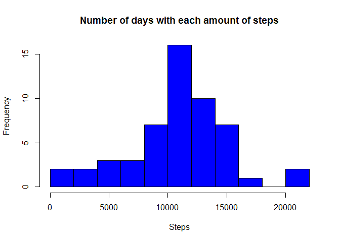
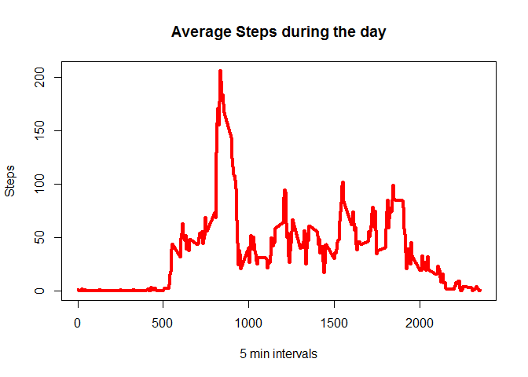
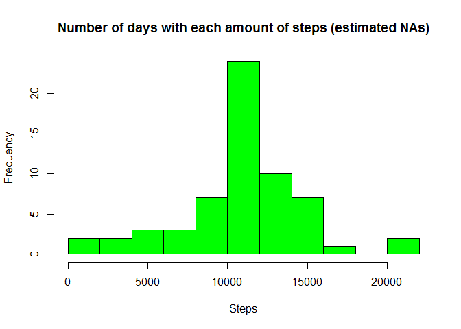
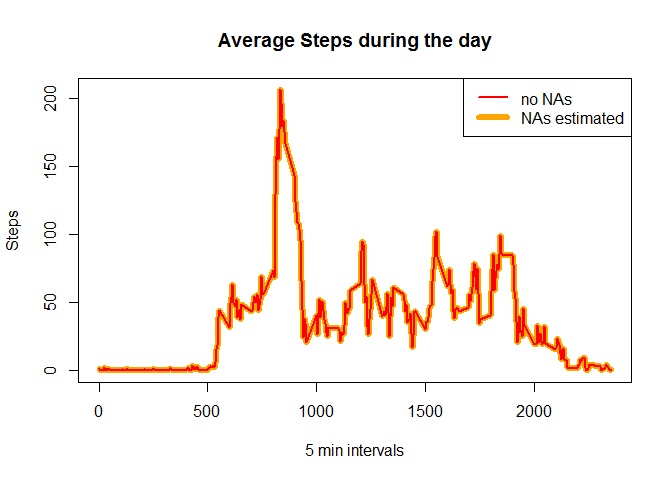
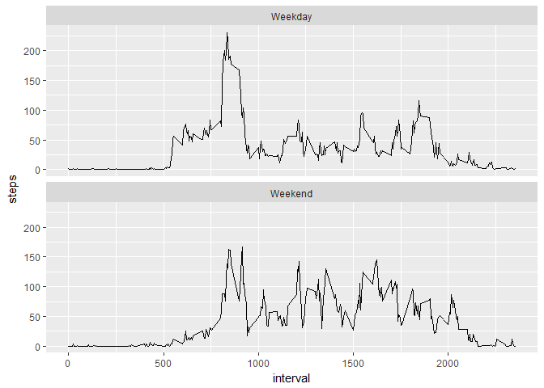

Peer-graded Assignment - Course Project 1"
============================================

## Loading and preprocessing the data

The variables included in this dataset are:


* steps: Number of steps taking in a 5-minute interval (missing values are coded as NA)
* date: The date on which the measurement was taken in YYYY-MM-DD format
* interval: Identifier for the 5-minute interval in which measurement was taken

Load the data (i.e. read.csv()) and process/transform the data (if necessary) into a format suitable for your analysis


```r
# unzip activity file
unzip(zipfile = "activity.zip")

# read in scv 
activity <- read.csv("activity.csv")

# look at data structure
head(activity)
```

```
##   steps       date interval
## 1    NA 2012-10-01        0
## 2    NA 2012-10-01        5
## 3    NA 2012-10-01       10
## 4    NA 2012-10-01       15
## 5    NA 2012-10-01       20
## 6    NA 2012-10-01       25
```

```r
str(activity)
```

```
## 'data.frame':	17568 obs. of  3 variables:
##  $ steps   : int  NA NA NA NA NA NA NA NA NA NA ...
##  $ date    : Factor w/ 61 levels "2012-10-01","2012-10-02",..: 1 1 1 1 1 1 1 1 1 1 ...
##  $ interval: int  0 5 10 15 20 25 30 35 40 45 ...
```

```r
summary(activity)
```

```
##      steps                date          interval     
##  Min.   :  0.00   2012-10-01:  288   Min.   :   0.0  
##  1st Qu.:  0.00   2012-10-02:  288   1st Qu.: 588.8  
##  Median :  0.00   2012-10-03:  288   Median :1177.5  
##  Mean   : 37.38   2012-10-04:  288   Mean   :1177.5  
##  3rd Qu.: 12.00   2012-10-05:  288   3rd Qu.:1766.2  
##  Max.   :806.00   2012-10-06:  288   Max.   :2355.0  
##  NA's   :2304     (Other)   :15840
```

```r
# add day of week using R dates
activity[4] <- weekdays(as.Date(activity$date))
names(activity)[4] <- "day"

head(activity)
```

```
##   steps       date interval    day
## 1    NA 2012-10-01        0 Monday
## 2    NA 2012-10-01        5 Monday
## 3    NA 2012-10-01       10 Monday
## 4    NA 2012-10-01       15 Monday
## 5    NA 2012-10-01       20 Monday
## 6    NA 2012-10-01       25 Monday
```


## What is mean total number of steps taken per day?

For this part of the assignment, you can ignore the missing values in the dataset.

```r
# create data set with no NAs
activity.nona <- activity[ !is.na(activity$steps), ]
```

Calculate the total number of steps taken per day

```r
# aggregate date to get total steps / day
step.day <- aggregate(steps ~ date, activity.nona, sum)

sum(step.day$steps)
```

```
## [1] 570608
```

Histogram of the total number of steps taken each day

```r
hist(step.day$steps, xlab = "Steps",main = "Number of days with each amount of steps",breaks = 10,col = "blue")
```

<!-- -->

Calculate and report the mean and median of the total number of steps taken per day

```r
table.step.day <- summary(step.day$steps)
```

## What is the average daily activity pattern?

Make a time series plot (i.e. type = "l") of the 5-minute interval (x-axis) and the average number of steps taken, averaged across all days (y-axis)

```r
step.5min <- aggregate(steps ~ interval, activity.nona, mean)

plot(
  x = step.5min$interval, y = step.5min$steps,type="l",
  lwd=4,col="red",
  main =  "Average Steps during the day",
  xlab = "5 min intervals",
  ylab = "Steps")
```

<!-- -->

Which 5-minute interval, on average across all the days in the dataset, contains the maximum number of steps?

```r
step.5min[which.max(step.5min$steps),]
```

```
##     interval    steps
## 104      835 206.1698
```


## Imputing missing values

Note that there are a number of days/intervals where there are missing values (coded as NA). The presence of missing days may introduce bias into some calculations or summaries of the data.

Calculate and report the total number of missing values in the dataset (i.e. the total number of rows with NAs)

```r
table(is.na(activity$steps))
```

```
## 
## FALSE  TRUE 
## 15264  2304
```

Devise a strategy for filling in all of the missing values in the dataset. The strategy does not need to be sophisticated. For example, you could use the mean/median for that day, or the mean for that 5-minute interval, etc.

```r
# make data frame of only NA rows
activity.nas <- activity[ is.na(activity$steps), ]

# Use 5 min interval data frame to replace NAs with mean for interval
activity.nas <- merge(x = activity.nas[,2:4],y = step.5min,by = "interval")
```

Create a new dataset that is equal to the original dataset but with the missing data filled in.

```r
# reorganize nas data frame and join with noNAs data frame to make complete data set with no NA's
activity.nas <- cbind.data.frame(activity.nas[,4],activity.nas[,2],activity.nas[,1],activity.nas[,3])
colnames(activity.nas) <- c("steps","date","interval","day")

activity.nasfiled <- rbind.data.frame(activity.nona,activity.nas)
```

Make a histogram of the total number of steps taken each day and Calculate and report the mean and median total number of steps taken per day. 

```r
step.day.nasfilled <- aggregate(steps ~ date, activity.nasfiled, sum)

hist(step.day.nasfilled$steps, xlab = "Steps",
     main = "Number of days with each amount of steps (estimated NAs)",
     breaks = 10,col = "green"
)
```

<!-- -->

```r
summary(step.day.nasfilled$steps)
```

```
##    Min. 1st Qu.  Median    Mean 3rd Qu.    Max. 
##      41    9819   10766   10766   12811   21194
```

Do these values differ from the estimates from the first part of the assignment? What is the impact of imputing missing data on the estimates of the total daily number of steps?

```r
summary(step.day.nasfilled$steps) - summary(step.day$steps)
```

```
##     Min.  1st Qu.   Median     Mean  3rd Qu.     Max. 
##    0.000  978.000    1.189    0.000 -483.000    0.000
```
When NAs are estimated there is **no change in the Mean** and **only a very small change in the Median** number of steps. The main difference is in the 3rd Quatrile. 


## Are there differences in activity patterns between weekdays and weekends?

For this part the weekdays() function may be of some help here. Use the dataset with the filled-in missing values for this part.

Create a new factor variable in the dataset with two levels - "weekday" and "weekend" indicating whether a given date is a weekday or weekend day.

```r
# fill in new column
activity.nasfiled[ grepl(pattern = "Saturday|Sunday",x = activity.nasfiled$day,ignore.case = T),5] <- "Weekend"
activity.nasfiled[ !grepl(pattern = "Saturday|Sunday",x = activity.nasfiled$day,ignore.case = T),5] <- "Weekday"
# name new column
colnames(activity.nasfiled)[5] <- "Weekday.end"
# make new column a factor
activity.nasfiled$Weekday.end <- as.factor(activity.nasfiled$Weekday.end)
```

Make a panel plot containing a time series plot (i.e. type = "l") of the 5-minute interval (x-axis)...

```r
step.5min.nasfill <- aggregate(steps ~ interval, activity.nasfiled, mean)

plot(
  x = step.5min.nasfill$interval, y = step.5min.nasfill$steps,type="l",
  lwd=6,col="orange",
  main =  "Average Steps during the day",
  xlab = "5 min intervals",
  ylab = "Steps"
)
lines(
  x = step.5min$interval, y = step.5min$steps,type="l",
  lwd=2,col="red")
legend(x = "topright", legend = c("no NAs","NAs estimated"),col = c("red","orange"),lwd = c(2,6))
```

<!-- -->

...and the average number of steps taken, averaged across all weekday days or weekend days (y-axis). See the README file in the GitHub repository to see an example of what this plot should look like using simulated data.

```r
step.5min.nasfill.day <- aggregate(steps ~ interval + Weekday.end, activity.nasfiled, mean)

library(ggplot2)
```

```
## Warning: package 'ggplot2' was built under R version 3.4.1
```

```r
ggplot(
  data = step.5min.nasfill.day, 
  aes(x = interval, y = steps)
) + geom_line() + facet_wrap(~Weekday.end, ncol = 1)
```

<!-- -->


